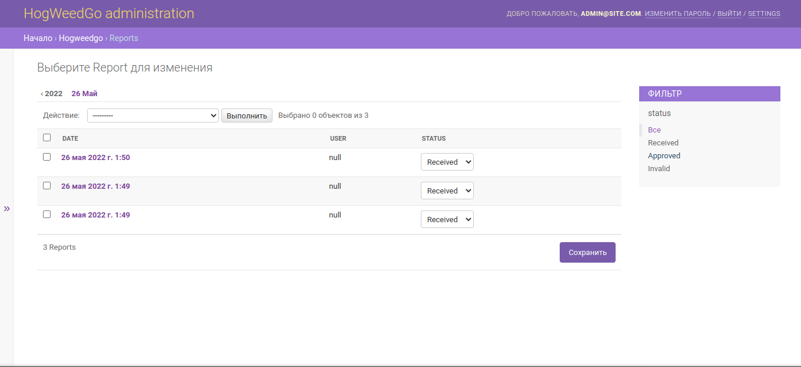
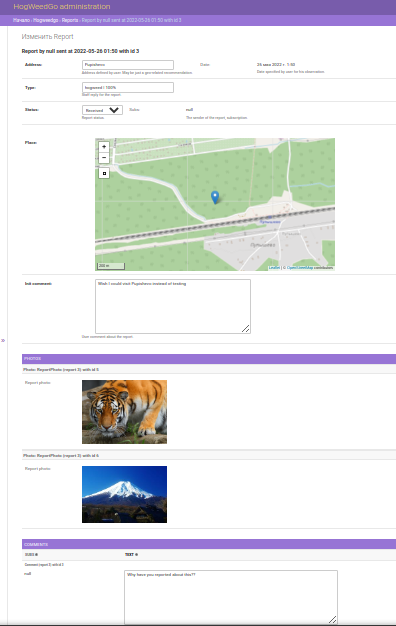
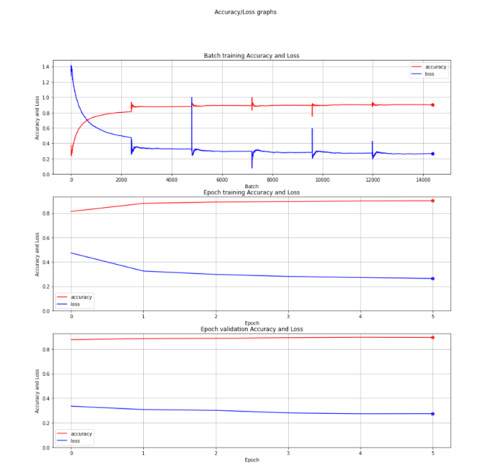
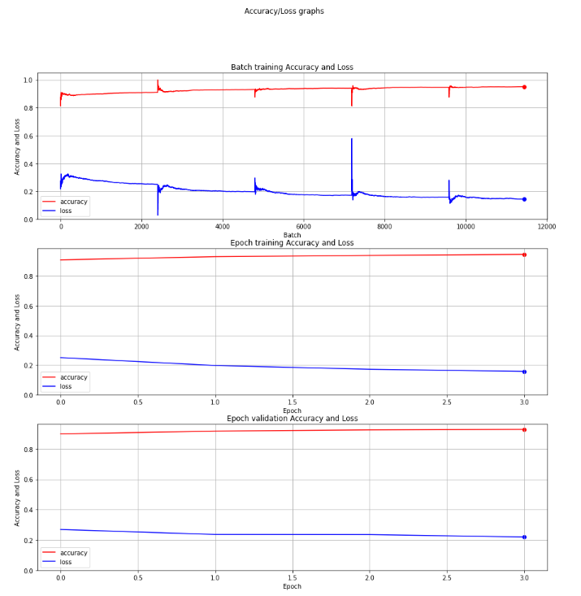

# HogWeedGo

[](https://github.com/pseusys/HogWeedGo/actions/workflows/server.yml)
[](https://github.com/pseusys/HogWeedGo/actions/workflows/client.yml)
[](https://github.com/pseusys/HogWeedGo/actions/workflows/ml-helper.yml)
[](https://github.com/pseusys/HogWeedGo/actions/workflows/report.yml)

A crowd-sourced monitoring system for *Heracleum sosnowskyi* (Sosnowsky's hogweed) — an invasive, phototoxic plant species spreading across northern Europe. Built as a bachelor's thesis project; **presented at the ETU MOEVM Scientific and Technical Seminar (2022)** and published in the proceedings (pp. 12–15). Full thesis report available as a [thesis report PDF](https://github.com/pseusys/HogWeedGo/releases/download/v0.0.1-report/report.pdf).

The system integrates a **geospatial REST backend**, a **cross-platform mobile client**, and an **on-device ML classifier**, forming a complete pipeline from field observation to expert review.

---

## Architecture

```text
┌───────────────────────────────────────────────────────────┐
│                        HogWeedGo                          │
│                                                           │
│   ┌──────────────┐     REST/JSON      ┌───────────────┐   │
│   │  Flutter     │ ◄────────────────► │ Django +      │   │
│   │  Mobile App  │                    │ PostGIS       │   │
│   │  (iOS/Android│                    │ Server        │   │
│   │  + TFLite    │                    │               │   │
│   │  classifier) │                    │ PostgreSQL DB │   │
│   └──────────────┘                    └───────────────┘   │
│                                                           │
│   ┌──────────────────────────────────────────────────┐    │
│   │  ML Helper (Jupyter)                             │    │
│   │  MobileNetV2 transfer learning → .tflite export  │    │
│   └──────────────────────────────────────────────────┘    │
└───────────────────────────────────────────────────────────┘
```

There are two classes of users: **volunteers** (field observers, drones, etc.) who submit geo-tagged photo reports, and **experts** (ecologists, administrators) who review, annotate, and manage reports through a web interface. The mobile client also runs an on-device classifier to guide the user before submission.

---

## Components

### Server — `server/`

**Stack:** Python 3, Django, Django REST Framework, PostGIS, Docker, Nginx

The server exposes a documented REST API ([OpenAPI 3.0 spec](./HogWeedGo.openapi.yml)) covering:

- **Authentication** — email-verified registration with time-limited OTP codes; token-based session auth with rate limiting
- **Reports** — geo-tagged submissions with multi-photo upload, status lifecycle (`RECEIVED` → `APPROVED` / `INVALID`), and comment threads
- **Geospatial storage** — geographic `PointField` (PostGIS) with address annotation
- **Expert web interface** — custom Django Admin with report management, user administration, and statistics
- **Backup/restore** — serialization modes supporting full database export and import, including media files (base64-encoded)

Production deployment uses Nginx + Gunicorn behind TLS, with auto-generated self-signed certificates and a config generation script. A Docker image is published automatically to GHCR on every push to `main`.




### Client — `client/`

**Stack:** Dart, Flutter (iOS + Android)

The mobile client provides:

- Interactive map displaying all submitted reports
- Geo-tagged photo report submission with on-device ML pre-classification
- User account management (profile photo, password, email change with OTP)
- Real-time report status tracking


### ML Helper — `ml-helper/`

**Stack:** Python, TensorFlow/Keras, Jupyter, scikit-learn

A Jupyter notebook pipeline for training and exporting the on-device plant classifier. See the [ML Helper README](./ml-helper/README.md) for full details.

**Model:** MobileNetV2 (ImageNet pretrained) with two-phase transfer learning  
**Dataset:** 21,300 images across 3 classes, sourced from iNaturalist and OpenImages  
**Accuracy:** >92% on held-out test set  
**Output:** `.tflite` model for direct embedding in the Flutter client  




---

## CI/CD

Four independent GitHub Actions workflows provide full automation:

- **`server.yml`** — (1) runs unit tests against a live PostgreSQL+PostGIS instance; (2) builds the full Docker stack and runs the Postman API test suite via Newman; (3) publishes the Docker image to GHCR; (4) updates the bundled release artifact
- **`client.yml`** — builds the Flutter Android APK
- **`ml-helper.yml`** — fetches the released `.tflite` model and runs the classifier test suite against the held-out CSV dataset
- **`report.yml`** — compiles the LaTeX thesis report and publishes it as a release asset

---

## Getting Started

### Run the server locally (Docker)

1. Download `bundled-server.zip` from the [releases page](https://github.com/pseusys/HogWeedGo/releases), unpack it, and open a shell there.
2. Run `./config-generator.sh [YOUR_DOMAIN]` to generate environment configs.
3. Run `docker-compose -f ./docker-compose.yml --env-file=./system-config.env up`.

See [server/README.md](./server/README.md) for full configuration reference (ports, SMTP mocking, HTTPS certificates, superuser credentials).

### Build the server from source

```bash
cd server
./config-generator.sh localhost
# Install dependencies and initialize the database:
./init-local.sh ./config.env server
# Run the test suite:
./init-local.sh ./config.env test
```

### Build the mobile client

```bash
cd client
flutter pub get
flutter build apk   # Android
flutter build ios   # iOS
```

### Train the ML model

See [ml-helper/README.md](./ml-helper/README.md).

---

## Repository Structure

```text
HogWeedGo/
├── server/          # Django backend (API, admin interface, PostGIS models)
├── client/          # Flutter mobile client (iOS + Android)
├── ml-helper/       # Jupyter training pipeline + TFLite export
├── report/          # LaTeX bachelor's thesis source
└── HogWeedGo.openapi.yml  # OpenAPI 3.0 API specification
```
