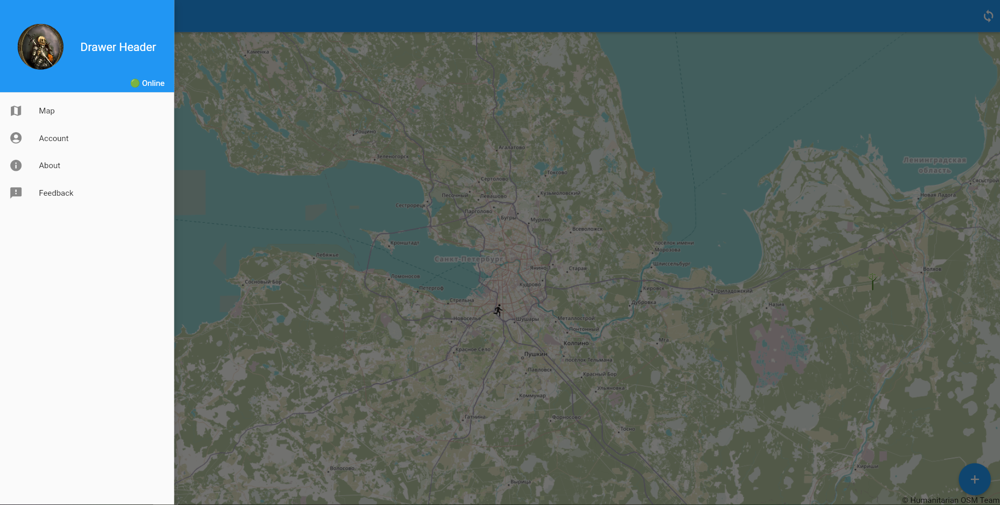
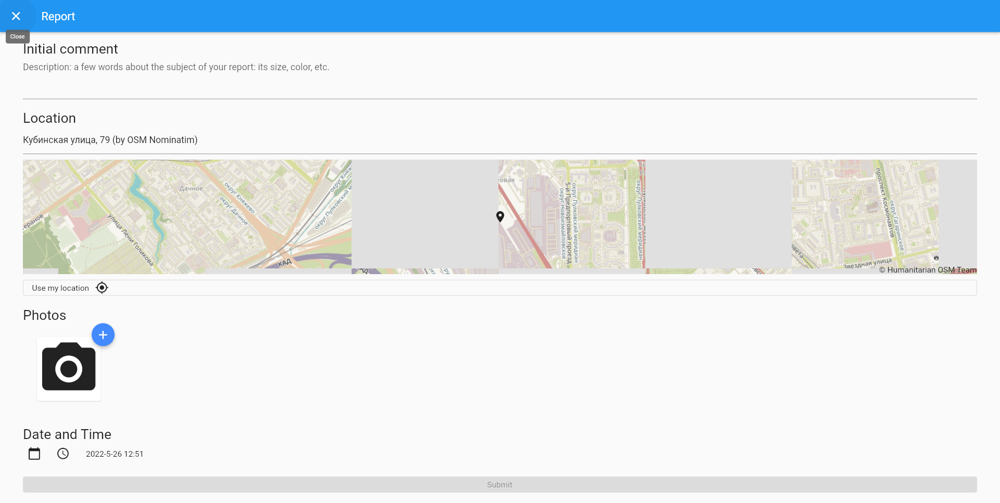
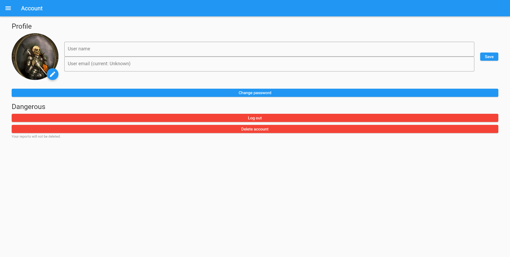

# HogWeedGo Client

[](https://github.com/pseusys/HogWeedGo/actions/workflows/client.yml)

The mobile client for [HogWeedGo](../README.md) — a cross-platform Flutter app (iOS + Android) for crowd-sourced monitoring of invasive hogweed. Field observers use the app to submit geo-tagged photo reports; an on-device TFLite classifier pre-labels each submission before it is sent to the server.

---

## Features

- **Interactive map** — browse all submitted reports with status indicators (`RECEIVED`, `APPROVED`, `INVALID`)
- **Report submission** — capture or upload a photo, attach GPS coordinates and a free-text description; the on-device MobileNetV2 classifier suggests a classification before submission
- **Account management** — register via email OTP, update profile photo, name, email, and password
- **Report tracking** — view status updates and expert comments on your own reports

---

## Screens





---

## Build

### Prerequisites

- [Flutter SDK](https://flutter.dev/docs/get-started/install)
- Android SDK (for Android builds) or Xcode (for iOS builds)

### Run

```bash
flutter pub get
flutter run
```

### Build release APK

```bash
flutter build apk
```

### Build for iOS

```bash
flutter build ios
```

---

## Configuration

The client connects to a HogWeedGo server instance. Update the base URL in the app configuration before building for production. See [server/README.md](../server/README.md) for server setup instructions.
